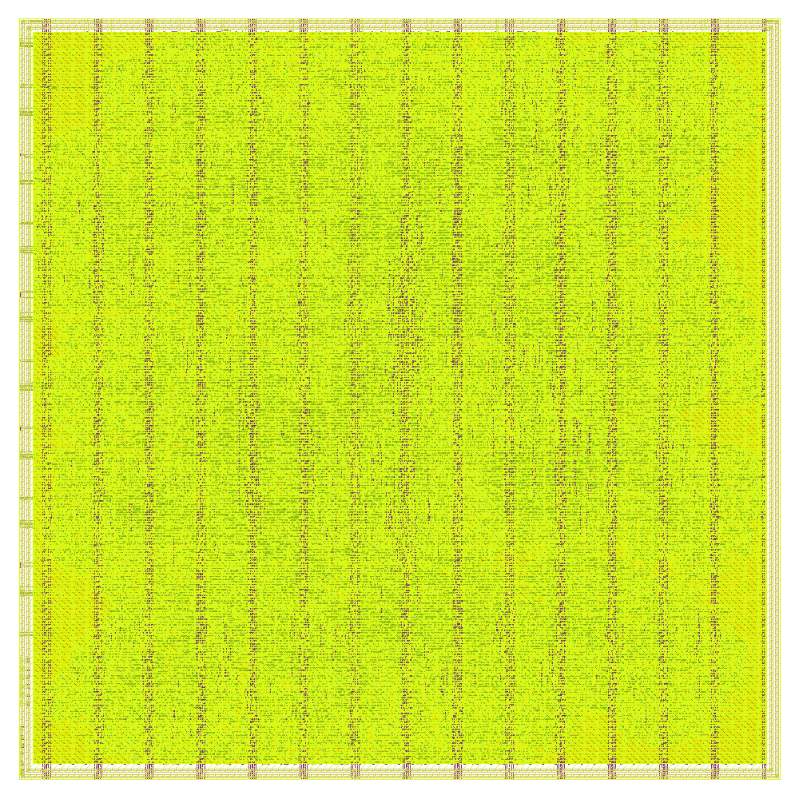

# A54 A-block wrapper

This directory contains a separate physical-design wrapper for the existing
`lstm16x_top` RTL.  The LSTM implementation is unchanged.  The new top-level
module, `A54_A`, exposes exactly the internal pad-cell terminals specified by
the organizer's latest `A54_A.def` template.

Physical requirements:

- origin: `(0, 0)`
- die/PR boundary: `1110 um x 1110 um`
- DEF template: `organizer_def/A54/project_defs/A/A54_A.def`
- final top cell: `A54_A`
- external pad assignments: 22 entries in `info.yaml`
- internal pad-cell interface terminals: 125, exactly matching the DEF template

The response pads are configured as outputs (`OE=1`, `IE=0`) with weak pulls
disabled.  Clock, reset, command-valid, and command-data pads are configured as
inputs with weak pulls disabled.

## What changed in this update

This revision adds separate closed VDD and VSS rings on Metal5. The organizer
power-access shapes are connected up to the rings through stacked vias, and the
rings connect to every existing vertical Metal4 PDN stripe. The pad-entry path
no longer terminates directly on Metal1.



The submitted `gds/A54_A.gds` was also exported without KLayout PCell or library
context information. Geometry XOR against the signoff source GDS is 0. Magic
DRC and Netgen LVS were rerun on this exact file: DRC count is 0 and LVS reports
`Circuits match uniquely`.

## DBU and integration

The A54 GDS is already at a database unit of 0.001 um, so the recent DBU notice
does not require another layout change for this project. The DRC/LVS recheck was
performed on the 0.001 um GDS.

We also tested the same file through the integration conversion:
`0.001 um -> 0.005 um -> 0.001 um`. The round-trip XOR is 0 on every layout
layer, and the `1110 um x 1110 um` boundary is unchanged. The organizer's
automatic DBU conversion therefore does not alter the A54 geometry.

Run the wrapper RTL test from this directory:

```sh
iverilog -g2012 -o tb_A54_A.vvp tb/tb_A54_A.sv rtl/A54_A.v rtl/core/*.v
vvp tb_A54_A.vvp
```

The expected final line is `WRAPPER PASS: signature=a8`.

## Final power-ring signoff results

- Magic DRC: 0
- Netgen LVS: circuits match uniquely; all reported mismatch counts are 0
- KLayout-versus-Magic stream-out XOR: 0 differences
- final-route antenna: 0 violating nets and 0 violating pins
- setup and hold: 0 violations in all nine reported corners
- worst setup slack: +48.2232 ns
- worst hold slack: +0.4085 ns
- maximum slew, capacitance, and fanout violations: 0 in all nine corners
- VDD worst IR drop: 0.140 V (2.81% of 5 V)
- VSS worst ground rise: 0.0294 V (0.59% of 5 V)
- OpenROAD power-grid connectivity: all shapes connected on both VDD and VSS
- GDS DBU: 0.001 um
- boundary on layer 0/0: exactly 1110 um x 1110 um

Raw reports are included under `verification/` in the submission package. The
GF180 LibreLane configuration used here does not provide a separate KLayout DRC
runset; the available signoff physical deck is Magic DRC, while stream-out
equivalence is independently checked by KLayout-versus-Magic XOR.
